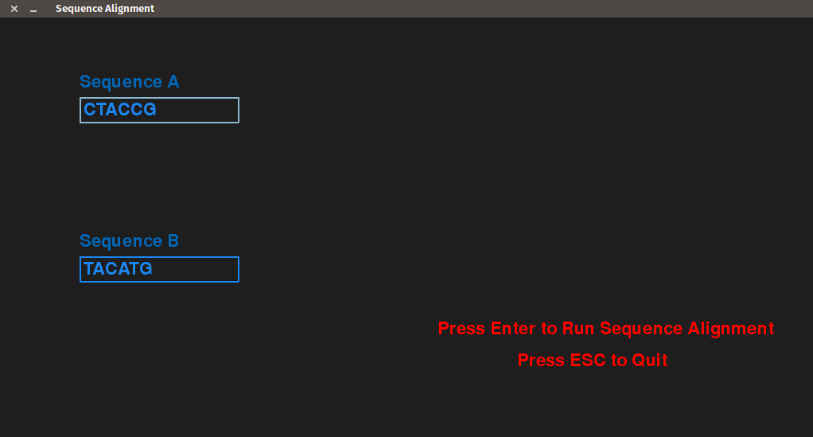
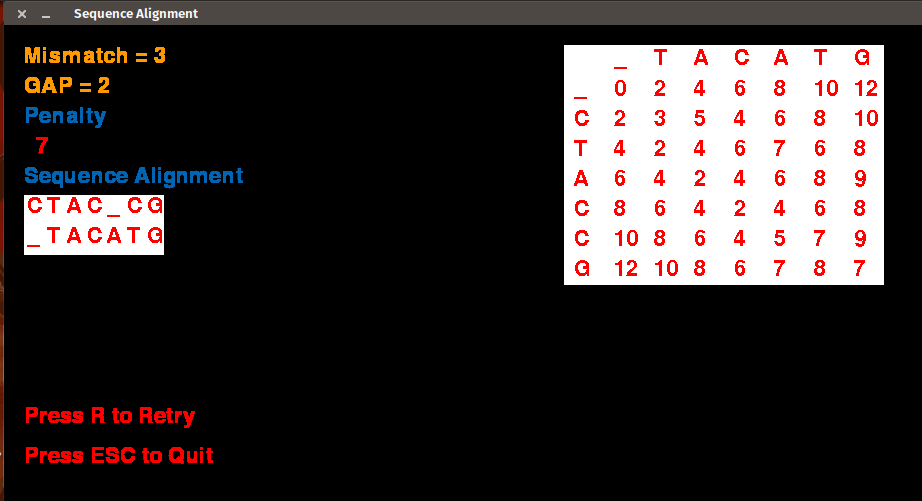

# <p align="center"> Python code for sequence alignment include graphic interface made with pygame </p>

## Autors

| Name  | University Registration  | GitHub | Email |
|---|---|---|---|
| Daniel Maike Mendes Gonçalves  | 16/0117003  | [DanMke](https://github.com/DanMke) | danmke@hotmail.com |
| Lucas Pereira de Andrade Macêdo  | 15/0137397  | [lukassxp](https://github.com/lukassxp) | lpalucas.10@gmail.com |

## Installation

> * ``` git clone https://github.com/projeto-de-algoritmos/Dynamic-Programming-List5-DanielGoncalves-LucasMacedo.git ``` <br> <br>
> * ``` pip3 install -r requirements.txt --user ```

## Execution

> * ```python3 pygame_interface.py```

## Sequence Alignment Problem 

<p align="justify">
The Sequence Alignment problem is one of the fundamental problems of Biological Sciences, aimed at finding the similarity of two amino-acid sequences. Comparing amino-acids is of prime importance to humans, since it gives vital information on evolution and development. Saul B. Needleman and Christian D. Wunsch devised a dynamic programming algorithm to the problem and got it published in 1970. Since then, numerous improvements have been made to improve the time complexity and space complexity, however these are beyond the scope of discussion in this post.
</p>

<p align="justify">
For solution we can use dynamic programming to solve this problem. The feasible solution is to introduce gaps into the strings, so as to equalise the lengths. Since it can be easily proved that the addition of extra gaps after equalising the lengths will only lead to increment of penalty.
</p>

## Screenshots of code execution





## References
 
> * https://www.geeksforgeeks.org/sequence-alignment-problem/
